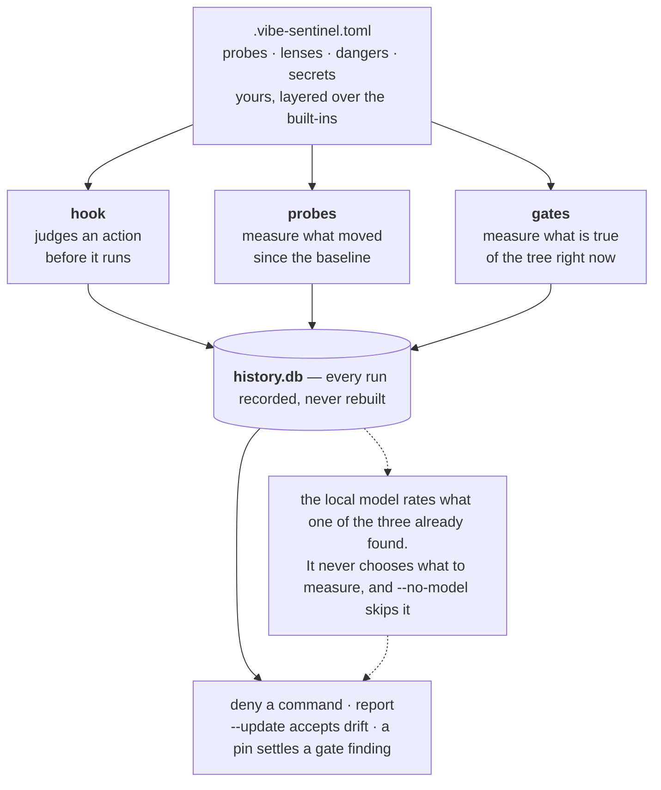

# Vibe Sentinel

*A necessary component for vibe coding beyond the prototype.*

## Table of Contents

- [GenAI-driven codebase maintenance and development challenges](#genai-driven-codebase-maintenance-and-development-challenges)
  - [Invisible Structural Drift](#invisible-structural-drift)
  - [Immediate Safety Risks](#immediate-safety-risks)
  - [Supply Chain & Provenance Issues](#supply-chain--provenance-issues)
- [Who Is Affected?](#who-is-affected)
- [How Vibe Sentinel Helps](#how-vibe-sentinel-helps)
- [What It Is Not](#what-it-is-not)
- [How impactful are issues with uncontrolled GenAI development?](#how-impactful-are-issues-with-uncontrolled-genai-development)
- [How Vibe Sentinel Works](#how-vibe-sentinel-works)
- [What Vibe Sentinel can find and report](#what-vibe-sentinel-can-find-and-report)
- [What It Costs to Adopt](#what-it-costs-to-adopt)
- [Getting Started](#getting-started)
- [Documentation](#documentation)
- [License](#license)

## GenAI-driven codebase maintenance and development challenges

### Invisible Structural Drift
- **Hundreds of "reasonable" edits**: Coding agents reshape your codebase quietly—directories grow past their purpose, code lands in wrong layers, modules become coupling hubs. No single commit looks wrong, but the cumulative effect is.
- **Shifting conventions**: How a model splits modules, places helpers, chooses abstractions—those live in its weights. Upgrade the model, and your style guide changes under you, commit by commit.

### Immediate Safety Risks
- **Dangerous actions**: `rm -rf`, `curl | sh`, force-pushes, installing undeclared packages. These leave no diff to review.

### Supply Chain & Provenance Issues
- **Hallucinated packages**: Generated code references package names that do not exist, at measurable rates—registrable by anyone who sees the output.
- **Malicious software**: Dependencies with suspicious or known-bad provenance.
- **Versions that move on their own**: An agent downgrades a package to make an error stop, or a resolver picks differently. The manifest still says what it said and the lock file is untouched, so nothing in the repository records what you are actually running.
- **Poisonous licenses**: AGPL or other disallowed licenses in your dependency tree.
- **Exposed credentials**: Secrets committed before you started looking.

## Who Is Affected?

**Use Vibe Sentinel if an agent writes to your repository.** This includes Claude Code, Cursor, Copilot Chat, or anything else that commits code, installs packages, or runs shell commands in a loop you do not read call by call. That last condition is the entire requirement: if you already review every agent action individually, you are already serving as the sentinel yourself.

**Use it if you lead a team that has adopted coding agents.** Six months of reasonable edits produces a codebase layout nobody chose, and this only becomes apparent when it is load-bearing and expensive to fix. A recorded baseline makes that cumulative change visible while it is still cheap to address, and the command journal answers *what have the agents been doing* with a record rather than a recollection.

**Use it if you are responsible for what the agents pull in** — security, platform, whoever owns the supply chain. Generated code references packages that do not exist, at the rates shown above, and those names are registrable by whoever else reads the same output. The licence that arrives with a lockfile bump and the key already sitting in the tree get in the same way: nobody decided on any of them.

Most teams match at least one of these, and the first run settles half of it: what is *true* of the tree needs no history. Drift is the other half, and it needs a second scan — which is the argument for taking the first one now.

## How Vibe Sentinel Helps

- **Records what your repository looks like** — establishes a baseline of structure, dependencies, patterns.
- **Measures drift** — flags when directories, modules, comment ratios, coupling move beyond your tolerances, and when an installed dependency is at a version or from a source it was not at yesterday.
- **Stops dangerous commands before they run** — safety gate blocks `rm -rf`, undeclared installs, based on what that agent already did.
- **Finds what's true now** — credentials at rest, dependency provenance, license policy. Reports every run until resolved.
- **Keeps a command journal** — answers "what have the agents been doing?" with a record, not recollection.
- **Model is optional** — `--no-model` runs all mechanical checks (CI path). Local model only rates what the mechanisms already found.

**The combination necessary for intelligent, reliable, predictable vibe coding: model + agent + sentinel.** The model generates. The agent acts. The sentinel remembers what the repository is supposed to look like, records what happens, flags meaningful drift, and can stop an irreversible command before it runs.

## What It Is Not

**It is not a linter, and it never judges whether your code is correct or good.** It measures how the codebase is *organized*, records that shape, and reports when that shape moves. It replaces nothing you already run: a linter, a type checker, a SAST scanner and a review process all read individual changes, which is the one thing this tool does not look at.

**It is not a vulnerability scanner.** It records which version of each dependency is installed and reports when one moves; it never asks whether that version has a published CVE. That question is answered well already — pip-audit, Dependabot, osv-scanner — and its answer is true of a repository no agent has ever touched, which is the line everything here sits on the other side of. Worth knowing what those tools send in order to answer it: pip-audit queries an index once per installed package, so one run hands a third party the name and exact version of everything on the machine. This tool reads the same set through `importlib.metadata` and tells nobody.

It judges two things, and neither of them is your code. The **safety gate** judges an agent's *action* before it runs — whether `rm -rf "$DIR"` is about to remove a build directory or a home directory is a question about what will happen, not about how the command is written. The **credentials gate** judges a *fact about the tree* — whether a string sitting in it would open something. Both have answers that do not depend on anyone's taste.

## How impactful are issues with uncontrolled GenAI development?

These results come from controlled research settings, not ordinary developer-session telemetry. They demonstrate the failure modes Vibe Sentinel is designed to address; they do not mean the same rates occur in every coding workflow.

| Finding | Study context |
|---|---|
| **54.7–84.7% harmful safety-violation rate** | [Saber](https://arxiv.org/html/2606.01317v1) evaluated 13 coding-capable models across 716 executable tasks in Docker-sandboxed project workspaces. |
| **82.5% harmful safety-violation rate when workspace warnings mattered** | Saber's contextual-warning scenario required agents to notice local evidence that made direct execution unsafe. |
| **74.83% realized harm without a command guard** | [CARE](https://arxiv.org/html/2607.21642v2) tested 600 agent-generated, attack-intent commands in the RedCode-gen benchmark; 449 passed and executed successfully without a guard. |
| **At least 5.2% vs. 21.7% hallucinated packages** | [Spracklen et al.](https://arxiv.org/abs/2406.10279) reported these averages for commercial and open-source models across 576,000 generated code samples. |

## How Vibe Sentinel Works

Three things measure, and none of them needs a model to do it. The local model is then asked one narrow question about what was found — it can rate, adjudicate or explain, and it can never add a finding the mechanism did not produce or drop one it did.



What separates the checks is *when* the answer arrives, and whether the check can stop anything by itself.

| When | Capability | What it catches | Command |
|---|---|---|---|
| **Before the command runs** | Safety gate | Dangerous shell operations, and installs of package names no manifest declares, judged against what that agent already ran. The only check that can refuse an action — and it ships off by default | `vibe-sentinel safety` |
| **As the agent works** | Command journal | Nothing. It records every tool call as it happens, which is what makes the review above answerable | `vibe-sentinel hook --install` |
| **From the first run** | Credentials at rest | Keys and passwords in source files, `.env` files, credential stores, and state files | `vibe-sentinel credentials` |
| | Dependency provenance | Phantom imports, undeclared dependencies, and suspicious package names | `vibe-sentinel packages` |
| | License policy | Dependencies with unexpected or disallowed licenses | `vibe-sentinel licenses` |
| **From the second run** | Structural drift | Directories, modules, code patterns, and the installed version and origin of every dependency, moving away from the recorded baseline — over a week or a month, the movement too slow for any single comparison, and the fitted direction no comparison of two points can show | `vibe-sentinel scan` |

Every one of them exits `1` when it found something, and only the safety gate stops anything on its own. The rest become gates when you route them into a pre-commit hook, a CI job, or back into the coding session — see [Getting Started](docs/getting-started.md#routing-it-somewhere).

The division of labour is the same in each case. A deterministic mechanism finds the facts; the model is asked one question about them.

| Check | The mechanism decides | The model is asked |
|---|---|---|
| `scan` (drift) | `compare()` produces the change list | how significant each change is |
| `safety` | triage selects which commands are worth a look | one question per matched danger, with that agent's own history |
| `credentials` | the rules find the candidate secrets | whether a candidate is live, from a prefix and its shape |
| `licenses` | the resolver settles the SPDX expression | to draft the note on a pin, after the gate has decided |
| `packages` | the declared graph and the installed set | whether two installed names an edit apart are two packages or one misspelling |

That is what keeps the output reproducible, and why the model can be small and local. It is pinned, and from a different family than the one changing the codebase, so the measuring instrument stays independent of the thing it measures.

The rules are yours for a related reason. A rule published widely enough enters the next training corpus, and a model trained on it writes code that satisfies it — at which point the rule stops measuring what it stood for. Probes, dangers, secrets and lenses are declared in your repository rather than shipped in the package, so what this tool checks is something no training run has seen.

## What Vibe Sentinel can find and report

A **state** is what is true of the tree right now: this dependency is AGPL, this key is in the working directory, this import resolves to nothing. It needs no history, so it is answerable the first time you run the tool — and it is as true on the two-hundredth scan as on the first, which is why it is reported on every run.

```text
State
  licenses: clean — 76 package(s) accepted, 0 finding(s); project licence MIT
  packages: clean — 76 installed, 13 declared in uv:.venv; 0 finding(s)
  credentials: 1 failing — 105 file(s) read, 18 candidate(s), 1 failing

  [credentials] src/config.py — A cloud access key id  (tracked)
      | 12: AWS_ACCESS_KEY_ID = "<redacted: 20 chars, entropy 3.7>"
      -> cloud-access-key: the prefix and entropy are consistent with an issued key

1 finding(s) stand. These are states, not drift: each one is reported
again on every scan until the cause is removed or a pin records the decision.
```

**Only a pin clears one, and a pin is not an ignore.** It is scoped to the rules it names, and `reason` and `verified` are required — so what a cleared finding leaves behind is a dated record of somebody having looked, rather than a suppression. Values are never printed, logged, or written to the history database; the excerpt above is what you see, and the model that judged it saw a short prefix and a shape. [Gates](docs/gates.md) has what each of the four checks does, how to configure the rules, and what clears a finding.

A **transition** is the other kind of finding: this directory gained four modules, this file doubled, this package's commentary ratio halved — or an installed dependency is at a different version than it was yesterday, which no diff shows, because a declared constraint lives in your manifest and a lock file lives in your repository but the version actually installed lives in neither. Reporting it once, when it happens, is right — and `scan --update` accepts it and moves the baseline.

```text
Drift since 2026-09-01T15:59:11+00:00
  + [high] new: vibe_sentinel/helpers: 14 comment lines / 14 code lines across 3 file(s)
      A new directory with a commentary ratio of 1.0 appears, sharply
      diverging from the codebase's overall 0.154 ratio.
  + [high] new: vibe_sentinel/helpers: 3 module(s), 36 lines
      The 'helpers' directory appears with 3 modules, suggesting a structural
      shift to organize functionality previously scattered elsewhere.
  + [medium] new: vibe_sentinel/helpers: 2 of 3 handler(s) discard the error
      Two of the three handlers in the new directory discard what they
      catch, against 0.12 for the package as a whole.

vibe-sentinel: 5 change(s), 5 worth attention.
```

One baseline shows drift at one scale, though: a directory gaining two modules a week is under every tolerance between consecutive scans and a reorganization by Christmas. So a scan reads the same recorded series three ways — against the baseline, against the run a week or a month back, and as a fitted direction across many runs. What gets measured is yours: a **probe** is a command with declared parameters that prints JSON, and a **lens** is a question about the resulting report, asked in your own words. Six probes ship. [Drift](docs/drift.md) has the protocol, the horizons and trends in full, and what the thresholds were measured against.

## What It Costs to Adopt

| | |
|---|---|
| **Hardware** | An OpenAI-compatible local backend — vLLM, Ollama, llama.cpp, LM Studio. A known-good setup is an 8B model on one NVIDIA GPU of about 20GB; on an Apple Silicon Mac it is Qwen3 14B under Ollama, or any other 12–14B local model. A scan makes a few small calls and none of them is long. No backend at all is supported: `--no-model` skips the two steps that need one and says in the report that they did not happen. That is the CI path. |
| **Your codebase** | Untouched. This is a command you point at a repository, not a library you import into one, and it installs *beside* your project — conda, venv, uv, poetry, pyenv all left alone. |
| **Setup** | Two installs per machine, one generated config file, one scan. The defaults measure the current directory and are usually right to start with. |
| **Runtime** | ~52 ms per hooked tool call for the journal, which judges nothing and blocks nothing. A scan is a handful of subprocess runs and about four small model calls. |
| **What leaves the machine** | Nothing. A credential excerpt refuses any endpoint that is not loopback, whatever the config says. The one exception is opt-in: `packages --online` asks a package index about names already flagged, and about the dependencies your `pyproject.toml` states publicly — never about the installed set. |
| **What it replaces** | Nothing — see [What It Is Not](#what-it-is-not). |

**Pre-1.0.** The CLI and the `.vibe-sentinel.toml` format may change between minor versions. The history database migrates rather than breaks.

## Getting Started

```bash
uv tool install vibe-sentinel     # beside your project, not into it

vibe-sentinel credentials         # what is true now — no config, no history
vibe-sentinel scan                # the gates, plus the baseline for next time
vibe-sentinel hook --install      # start the journal
```

Full instructions — the backend, the config, the journal, and how to route a check into pre-commit or CI — are in [Getting Started](docs/getting-started.md).

## Documentation

| Topic | File |
|---|---|
| Getting started — install, backend, first scan, routing | [docs/getting-started.md](docs/getting-started.md) |
| Gates — credentials, provenance, licences, command safety | [docs/gates.md](docs/gates.md) |
| Drift — probes, lenses, horizons, trends | [docs/drift.md](docs/drift.md) |
| Use of the local model | [docs/use-of-local-model.md](docs/use-of-local-model.md) |
| History database | [docs/database.md](docs/database.md) |
| Development and contributing | [docs/development.md](docs/development.md) |

## License

MIT
