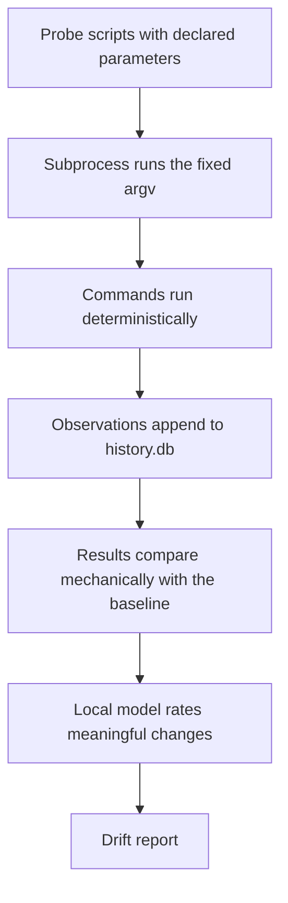

# Vibe Sentinel

*A necessary component for vibe coding beyond the prototype.*

Coding models are powerful, but they do not preserve the architectural intent of a particular repository across hundreds of changes. Each edit may look reasonable while directories grow past their purpose, code moves into the wrong layers, and modules become coupling hubs.

**The combination necessary for intelligent, reliable, predictable vibe coding: model + agent + sentinel.** The model generates. The agent acts. The sentinel remembers what the repository is supposed to look like, records what happens, flags meaningful drift, and can stop an irreversible command before it runs.

## What Vibe Sentinel Does

Every check here measures something and exits `1` if it found something. What separates them is *when* the answer arrives, and whether it can stop anything by itself.

| When | Capability | What it catches | Command |
|---|---|---|---|
| **Before the command runs** | Safety gate | Dangerous shell operations, judged against what that agent already ran. The only check that can refuse an action — and it ships off by default | `vibe-sentinel safety` |
| **As the agent works** | Command journal | Nothing. It records every tool call as it happens, which is what makes the review above answerable | `vibe-sentinel hook --install` |
| **Whenever you ask** | Structural probes | Directories, modules, dependencies, and code patterns drifting away from the recorded baseline — over a week or a month, the movement too slow for any single comparison, and the fitted direction no comparison of two points can show | `vibe-sentinel scan` |
| | Dependency provenance | Phantom imports, undeclared dependencies, and suspicious package names | `vibe-sentinel packages` |
| | License policy | Dependencies with unexpected or disallowed licenses | `vibe-sentinel licenses` |
| | Credentials at rest | Keys and passwords in source files, `.env` files, credential stores, and state files; `--home` also checks `~/.aws/credentials`, `~/.netrc`, SSH keys | `vibe-sentinel credentials` |

The last four are one kind of thing, and none of them stops anything on its own. A check becomes a gate only when you route it somewhere: a pre-commit hook, a CI job, or back into the coding session with `--format agent`. Exit codes are designed for that: `0` means no issues, `1` means issues found, `2` means the run itself failed.

Three of the four also run as part of `vibe-sentinel scan`, and every one of them records what it found. They are not probes, and the difference is the point: a probe reports **drift** — what moved since the baseline — while these report a **state**. A licence or a key in the tree is as true on the two-hundredth scan as the first, so it is reported on every run, and a new baseline does not settle it. Only a pin does, and a pin has to say what it covers, why, and when somebody checked.

The safety gate is the exception. In `enforce` mode the `PreToolUse` hook refuses the tool call before it runs; an `unclear` verdict does not, and falls through to the permission prompt you already have.

Scan history is appended to `.vibe-sentinel/history.db` and is never overwritten.

## How It Works

Every check has the same shape. A deterministic mechanism finds the facts, and the local model is then asked one narrow question about what was found. It can rate, adjudicate, or explain; it can never add a finding the mechanism did not produce, or drop one it did.

| Check | The mechanism decides | The model is asked |
|---|---|---|
| `scan` (drift) | `compare()` produces the change list | how significant each change is |
| `scan` (state) | the three gates below, run on every scan | see their rows |
| `safety` | a pattern match selects which commands are worth a look | one question per matched danger, with that agent's own history |
| `credentials` | the rules find the candidate secrets | whether a candidate is live, from a prefix and its shape |
| `licenses` | the resolver settles the SPDX expression | to draft the note on a pin, after the gate has decided |
| `packages` | the declared graph and the installed set | whether two installed names an edit apart are two packages or one misspelling — the only kind here that is not a fact |

`scan` runs the last three as well as the probes, so one command answers both *what moved* and *what is true*. Each also runs on its own, with its own exit code, and every run of either kind is recorded.

That is what keeps the output reproducible, and why the model can be small and local. It is pinned, and from a different family than the one changing the codebase, so the measuring instrument stays independent of the thing it measures.

The rules are yours for a related reason. A rule published widely enough enters the next training corpus, and a model trained on it writes code that satisfies it — at which point the rule stops measuring what it stood for. Probes, dangers, secrets and lenses are all declared in your repository rather than shipped in the package, so what this tool checks is something no training run has seen.

The model never chooses what to measure. It rates a change the comparison already found, and judges a credential candidate the pattern match already flagged — that is all. Measuring is mechanical, so everything works with no model at all: `--no-model` skips the rating and the adjudication, and reports that they did not happen. That is the CI path.

One boundary is stricter than the rest. A credential excerpt goes to the configured endpoint and nowhere else, and refuses to go even there unless that endpoint is loopback.

A scan is the longest of these paths:



The journal is the shortest: the hook records the tool call and returns.

**Pre-1.0.** The CLI and the `.vibe-sentinel.toml` format may change between
minor versions. The history database migrates rather than breaks.

## Quick Start

Vibe Sentinel needs Python 3.13 and an OpenAI-compatible local backend such as vLLM, Ollama, llama.cpp, or LM Studio. Your project needs neither — this is a command you point at a repository, not a library you import into one.

### 1. Install

Install it *beside* your project rather than into it. The environment your code already uses — conda, venv, uv, poetry, pyenv — is left alone, and `vibe-sentinel` works from any directory.

```bash
# uv, once per machine
curl -LsSf https://astral.sh/uv/install.sh | sh                                    # macOS / Linux
powershell -ExecutionPolicy ByPass -c "irm https://astral.sh/uv/install.ps1 | iex"  # Windows

# the tool, once per machine
uv tool install git+https://github.com/authentic-research-partners/vibe-sentinel
# or, from a clone of this repo:  uv tool install .
```

`uv tool` fetches the 3.13 interpreter it needs, so whatever Python your project runs on is irrelevant. `pipx install --python 3.13 git+https://github.com/authentic-research-partners/vibe-sentinel` does the same if you already use pipx. Once `0.1.0` is on PyPI the URL becomes the name: `uv tool install vibe-sentinel`.

If your project's own environment is already on Python 3.13 and you would rather have the tool inside it — to run it in CI alongside your other dev dependencies, say — activate that environment and install there instead:

```bash
uv pip install git+https://github.com/authentic-research-partners/vibe-sentinel   # uv-managed venv
pip install git+https://github.com/authentic-research-partners/vibe-sentinel      # conda, venv, pyenv
```

Every command below runs from the root of the repository you want to watch. Developing Vibe Sentinel itself is a different setup — see [docs/development.md](docs/development.md).

### 2. Start the Model Backend

Any OpenAI-compatible endpoint works — vLLM, Ollama, llama.cpp, LM Studio.
Point `[llm] endpoint` and `[llm] model` at whatever you serve. An 8B model is
enough: a scan makes a few small calls and none of them is long.

A known-good setup, on an NVIDIA GPU of about 20GB, under Podman — Docker takes
the same arguments with `--gpus all` in place of `--device`:

```bash
podman run -d --name vibe-sentinel-llm --device nvidia.com/gpu=all \
    -p 5001:8000 -v ~/.cache/huggingface:/root/.cache/huggingface \
    docker.io/vllm/vllm-openai:v0.18.0 RedHatAI/Qwen3-8B-FP8-dynamic \
    --served-model-name qwen3-8b-fp8 --max-model-len 40960 \
    --gpu-memory-utilization 0.85 --kv-cache-dtype fp8
```

Put that argv in `[llm] start_command` and the tool runs it for you:

```bash
vibe-sentinel backend start
vibe-sentinel backend status
```

### 3. Create a Probe Configuration

```bash
vibe-sentinel scan --print-example > .vibe-sentinel.toml
```

### 4. Record the Baseline

```bash
vibe-sentinel scan
```

### 5. Check for Drift Later

```bash
vibe-sentinel scan       # Baseline, 1w and 1m horizons, and the fitted trend
vibe-sentinel trend      # See movement across multiple runs
```

## What Drift Looks Like

```text
Drift since 2026-09-01T15:59:11+00:00
  + [high] new: vibe_sentinel/helpers: 14 comment lines / 14 code lines across 3 file(s)
      A new directory with a commentary ratio of 1.0 appears, sharply
      diverging from the codebase's overall 0.154 ratio.
  + [high] new: vibe_sentinel/helpers: 3 module(s), 36 lines
      The 'helpers' directory appears with 3 modules, suggesting a structural
      shift to organize functionality previously scattered elsewhere.
  + [medium] new: vibe_sentinel/helpers/validation_rules.py: 0 internal import(s), 26 lines
  + [medium] new: vibe_sentinel/helpers: 2 of 3 handler(s) discard the error
      Two of the three handlers in the new directory discard what they
      catch, against 0.12 for the package as a whole.

vibe-sentinel: 5 change(s), 5 worth attention.

State
  licenses: clean — 76 package(s) accepted, 0 finding(s); project licence MIT
  packages: clean — 76 installed, 13 declared in uv:.venv; 0 finding(s)
  credentials: 1 failing — 105 file(s) read, 18 candidate(s), 1 failing

  [credentials] src/config.py — A cloud access key id  (tracked)
      | 12: AWS_ACCESS_KEY_ID = "<redacted: 20 chars, entropy 3.7>"
      -> cloud-access-key: the prefix and entropy are consistent with an issued key

1 finding(s) stand. These are states, not drift: each one is reported
again on every scan until the cause is removed or a pin records the decision.
```

Two halves, and they mean different things. **Drift** is what moved since the baseline, and `scan --update` accepts it. **State** is what is true of the tree right now — reported on every run, whether or not it changed, and a new baseline does not settle it. Only a pin does, and a pin has to say what it covers, why, and when somebody checked.

Values are never printed, logged, or written to the history database. What you see above is the redacted excerpt; the model that judged it saw a short prefix and a shape, and only because the endpoint is on this machine.

`scan` exits `1` for either — drift or a standing finding — and `2` if a probe or a gate could not run. Use `--format agent` for agent constraints or `--format json` for structured output; the JSON always carries a `gates` key, empty rather than absent when nothing ran, so "no findings" is never confused with "not checked".

## Why This Matters

These results come from controlled research settings, not ordinary developer-session telemetry. They demonstrate the failure modes Vibe Sentinel is designed to address; they do not mean the same rates occur in every coding workflow.

| Finding | Study context |
|---|---|
| **54.7–84.7% harmful safety-violation rate** | [Saber](https://arxiv.org/html/2606.01317v1) evaluated 13 coding-capable models across 716 executable tasks in Docker-sandboxed project workspaces. |
| **82.5% harmful safety-violation rate when workspace warnings mattered** | Saber's contextual-warning scenario required agents to notice local evidence that made direct execution unsafe. |
| **74.83% realized harm without a command guard** | [CARE](https://arxiv.org/html/2607.21642v2) tested 600 agent-generated, attack-intent commands in the RedCode-gen benchmark; 449 passed and executed successfully without a guard. |
| **At least 5.2% vs. 21.7% hallucinated packages** | [Spracklen et al.](https://arxiv.org/abs/2406.10279) reported these averages for commercial and open-source models across 576,000 generated code samples. |

See [Gates](docs/gates.md) for what each of the three checks, how to configure it, and what clears a finding.

## Drift Horizons

The baseline is one point in time, and one point shows drift at one scale. A directory gaining two modules a week is under every tolerance between consecutive scans and a reorganization by Christmas — and which scale it shows up at is not something you know in advance.

So every scan reports the baseline comparison *and* the same measurements over longer horizons, each against the newest run at least that old:

```
No change since 2026-08-31T09:14:02+00:00.

Also moved, over longer horizons  (mechanical comparison; no model rated
these and none of them changes the exit code)
  1w   run 41, 8d ago — no movement
  1m   run 12, 31d ago — 2 change(s)
         ^ [low] src/db: 4 -> 9 modules
         v [low] commentary ratio: 0.24 -> 0.14
  6m   not measured — no run recorded 6m or more ago; this history starts at 2026-07-25T…
```

```toml
[drift]
horizons = ["1w", "1m"]     # the shipped default; [] turns them off
```

Units are `h`, `d`, `w`, `m` (30 days) and `y`; `--since 1w,3m` overrides the declared set for one run, and `--since ''` skips them. This costs no measurement and no model — both ends are already recorded, so a horizon is a query.

A horizon is a **reading, not a verdict**. It never moves the baseline, is never written to the database, and never changes the exit code: it reaches back to a fixed point, so a finding there would fail every scan until it aged out with nothing anyone could do to clear it. And a horizon nothing reaches back to says so rather than reading as clean.

## Trends and Anomalies

A horizon compares two points. A *direction* is a property of all of them, so no comparison of two can show one — and that is the drift that never trips anything: two modules a week clears no tolerance and is a reorganization by Christmas.

Every scan therefore also fits each recorded series, and scores the value it just measured against a fit made without it:

```
Sustained trends  (Theil–Sen slope and Mann–Kendall p over 45 run(s);
no model rated these and none of them changes the exit code)
  ! anomaly  module-organization  dir:src/handlers
               19 this run where the trend expected 6.007   z=+64.6
  ^ rising   module-organization  dir:src/db
               +0.28 per run, 9 -> 21.3 over 45 run(s)   tau=+0.96  p<0.001
  v falling  commentary-ratio     src
               -0.00213 per run, 0.218 -> 0.124 over 45 run(s)  tau=-0.95  p<0.001
```

```toml
[drift]
trend_runs = 50     # runs to fit over; 0 turns the fits off
```

`--fit N` overrides that for one scan. A direction needs 10 runs of the same observation, where the significance test becomes calibrated; an anomaly needs 20, because the scale one is measured in is what a short series cannot estimate. Below either floor the series is absent from the report rather than reported as flat.

Three estimators, all closed-form and all in the standard library — there is no model here, nothing to train, and no dependency:

| | | Why this one |
|---|---|---|
| **Theil–Sen** | the slope | The median of the pairwise slopes. One refactor that halves a directory drags a least-squares line through a series that never trended — on the test case in the suite, from 3.0 to 8.3. |
| **Mann–Kendall** | whether it means anything | Nonparametric, so it assumes nothing about how "modules per directory" is distributed, which is as well, because nobody knows. Measured at 4.4% false positives against its nominal 5%. |
| **MAD on the residuals** | anomalies | Detrended first: in a directory growing for months, every early value is far from the *mean* and none of them is a surprise. What is a surprise is a point far from the *trend*. |

Thresholds are measured rather than inherited. The usual MAD cutoff of 3.5 fires on 8.4% of clean values when the scale is estimated from ten runs — fifteen false alarms per scan on this repository — so an anomaly needs 20 runs of history and 5.0 deviations, and a direction needs 10 runs, where the significance test becomes calibrated. `vibe_sentinel/trends.py` carries both measurement tables and what they cost in power.

Like a horizon, a fit is a **reading**: it moves no baseline, is never stored, and changes no exit code.

```bash
# Fit every observation: directions, and points that left their own trend
vibe-sentinel trend

# One series, with the fitted value beside each point
vibe-sentinel trend --probe module-organization --key dir:src/helpers

# Fit over a different span, or lower the floor a series must clear
vibe-sentinel trend --runs 120 --min-runs 15

# Override the fit span for one scan; 0 skips the fits entirely
vibe-sentinel scan --fit 100
vibe-sentinel scan --fit 0

# Recorded runs and details for one run
vibe-sentinel history
vibe-sentinel history --run N

# Parameters selected for a probe on each run
vibe-sentinel parameters <probe>
```

## Custom Probes

A probe is a command with named parameters, each declared with the value it takes. It may call a script in any language as long as the script prints the required JSON protocol:

```json
{
  "observations": [
    {"key": "src/db", "value": 12.0, "label": "src/db: 12 modules"}
  ],
  "summary": "..."
}
```

Keys must remain stable between runs because they identify comparable observations. A key not seen in the baseline is automatically reported as a finding.

`tolerance` is how far a value may move before it counts as drift, and it takes two forms. A bare number is absolute, in the value's own units — `0.05` on a comment ratio is five points, and `0` means any change surfaces. A percentage string, `tolerance = "15%"`, is relative to the value it is compared against, which is the only form that works for a magnitude: 25 lines is a rewrite of a 40-line module and rounding error in a 1,700-line one.

### Lenses

A probe says what is measured. A **lens** says what to make of it: one question about the whole report — the changes, what the same measurements did over each horizon, and what the fitted series are doing — asked in your words.

```toml
[[lens]]
id = "handler-bloat"
title = "Handlers becoming the place anything unclaimed goes"
watch = ["file-length", "module-organization"]
question = """
Is the growth in api/handlers/ ordinary feature work, or is that directory
becoming where anything without an obvious home gets put? A handler should stay
thin: route, validate, one call into a service.
"""
```

Each lens is its own request and the report is the shared prefix, so a server that batches prefills it once and three questions cost close to what one does. `watch` names the probes a lens is about and is what keeps that true: a lens whose probes did not move, did not move over a horizon, and have no fitted trend is not asked at all, and is reported as not asked rather than as having found nothing. Set `[drift] concurrency = 1` on a backend that serialises.

A lens can only rate changes the comparison already found, the same boundary the built-in analysis keeps. `[drift] guidance` is a standing note placed in front of every question; `use`, `disable` and `use_builtins` select from the set the same way they do for probes and dangers.

### Built-in Probes

| Probe | Measures | Catches |
|---|---|---|
| `commentary-ratio` | Comment and code lines per package | Commentary growing out of proportion to code |
| `module-organization` | Modules, lines, and internal imports both ways | Directories growing past intent; a module reaching further, or more of the codebase coming to depend on it |
| `silent-exceptions` | Handlers that discard the error, against how many handlers there are | Error handling quietly becoming error hiding, and the layer it started in |
| `pattern-census` | ast-grep pattern occurrences | Constructs spreading into unexpected layers |
| `file-length` | How long each file is, in categories you name | `CLAUDE.md` growing a section per session; the module everything gets appended to; docs outgrowing the code they describe |

Licences, dependency provenance and credentials are **gates**, not probes, and `scan` runs them alongside the probes. The difference is what the finding is. A probe reports a *transition* — this directory gained four modules — which is right to report once, when it happens. A gate reports a *state*, and a licence or a key in the tree is as true on the two-hundredth scan as the first, so it is reported every run and a new baseline does not settle it:

| Gate | Reports | Cleared by |
|---|---|---|
| `licenses` | Dependencies and vendored files whose licence your policy does not accept | `[[licenses.pin]]` |
| `packages` | Imports that resolve to nothing, undeclared packages, names one edit from a real one | `[[packages.pin]]` |
| `credentials` | Credential-shaped strings and their Git status | `[[credentials.pin]]` |

Your configuration merges with the built-ins. Reuse a built-in ID to override it, disable individual probes, or set `use_builtins = false` to start from scratch.

```toml
[[probe]]
id = "commentary-ratio"
title = "Comment lines vs. code lines, per package"
command = [
    "python", "-m", "vibe_sentinel.probes.comments",
    "--root", "{SOURCE_ROOT}",
    "--glob", "{FILE_GLOB}",
]
tolerance = 0.05

[[probe.placeholders]]
name = "SOURCE_ROOT"
description = "The directory containing this project's source code."
default = "."
pattern = '^[a-zA-Z0-9_\-./]+$'
```

Write regex patterns as TOML literal strings with single quotes. Every placeholder needs a `default` — that is its value, and one without it is refused when the config loads. Values are validated against their declared `pattern`, substituted into fixed argument lists per element, and executed with `shell=False`.

To point a built-in probe somewhere else without restating it:

```toml
[probes.parameters]
commentary-ratio = { SOURCE_ROOT = "src" }
module-organization = { PACKAGE_ROOT = "src/myapp" }
file-length = { CATEGORIES = "agent=CLAUDE.md; adr=docs/adr/*.md; docs=*.md; code=src/**/*.py; tests=tests/*.py" }
```

`CATEGORIES` is the one parameter that carries its own syntax: `name=glob,glob; name=glob`, where a glob matches at any depth and a slash anchors that much of the path. Entries are tried in order and the first that matches a file claims it, so name specific files before the globs that would swallow them — with `docs=*.md` first, `CLAUDE.md` is documentation and the category meant to watch it is empty. A category that matched nothing is named in the probe's summary rather than omitted, so a typo reads as a typo.

Redeclaring a `[[probe]]` replaces it wholesale, which freezes its command at whatever you copied; this changes the value and leaves the rest to keep improving. Virtualenvs, `node_modules`, `build`, `dist` and caches are never measured whatever the root says.

## Documentation

| Topic | File |
|---|---|
| Credentials, provenance and command safety | [docs/gates.md](docs/gates.md) |
| Use of the local model | [docs/use-of-local-model.md](docs/use-of-local-model.md) |
| History database | [docs/database.md](docs/database.md) |
| Development and contributing | [docs/development.md](docs/development.md) |

## License

MIT
