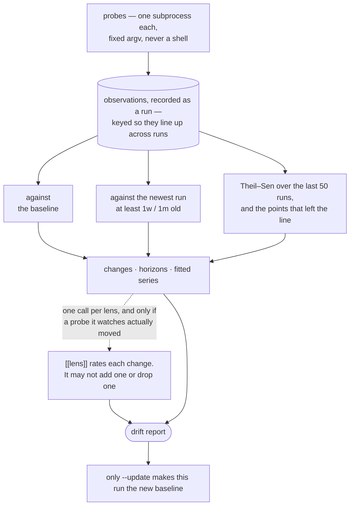

# Drift

A gate reports a **state** — this dependency is AGPL, this key is in the tree —
and it is as true on the two-hundredth scan as on the first. A probe reports a
**transition**: this directory gained four modules, this file doubled, this
package's commentary ratio halved. A transition is right to report once, when it
happens, and `scan --update` accepts it.

Drift is the part of this tool that needs history, and the first scan is only
ever a baseline. What it can tell you grows with the record:

| Reading | Needs | Answers |
|---|---|---|
| **Baseline** | two runs | what moved since the run you last accepted |
| **Horizon** | a run at least that old | what moved over a week, a month, a year |
| **Trend** | 10 runs for a direction, 20 for an anomaly | which way it has been going all along |

The last two are **readings, not verdicts**. None of them move the baseline, none are stored, and none change the exit code — a horizon reaches back to a fixed
point and a slope persists for as long as the window, so a finding in either
would fail every scan until it aged out, with nothing anyone could do to clear
it. Only the baseline comparison sets the exit code.

Every key, with commentary: `vibe-sentinel scan --print-example`.

All three readings come from one run, measured once:



---

## What a scan compares

```text
Drift since 2026-09-01T15:59:11+00:00
  + [high] new: vibe_sentinel/helpers: 14 comment lines / 14 code lines across 3 file(s)
      A new directory with a commentary ratio of 1.0 appears, sharply
      diverging from the codebase's overall 0.154 ratio.
  + [high] new: vibe_sentinel/helpers: 3 module(s), 36 lines
      The 'helpers' directory appears with 3 modules, suggesting a structural
      shift to organize functionality previously scattered elsewhere.
  + [medium] new: vibe_sentinel/helpers/validation_rules.py: 0 internal import(s), 26 lines
  + [medium] new: vibe_sentinel/helpers: 2 of 3 handler(s) discard the error
      Two of the three handlers in the new directory discard what they
      catch, against 0.12 for the package as a whole.

vibe-sentinel: 5 change(s), 5 worth attention.
```

`scan --update` accepts this and makes this run the baseline that the next scan compares against. Without it, a scan that finds drift does not become the new
baseline — every scan is *recorded* either way, but accepting drift is a
deliberate act.

### The four kinds of change

A key absent from the baseline **appeared**; one no longer there
**disappeared**; a number that moved past its probe's tolerance **grew** or
**shrank**; and a *state* that moved at all **changed**.

The fourth is the one that needs explaining. Most structural facts are
magnitudes — a directory holds nine modules, a file runs to 400 lines — and a
magnitude has a tolerance, because 401 lines is nearer to 400 than 900 is. Some
facts are not. An installed package is at 2.32.5; a vendored file carries
Apache-2.0. Those are identities, and the drift question about an identity is
not how far it moved but whether it is still the same one. So a state has no
tolerance, because a string has no distance: `2.32.5` is not nearer to `2.32.4`
than to `1.0.0` in any sense a probe could declare, and any move counts.

The key stays stable through it. Putting the version in the key —
`requests==2.32.5` — would make an upgrade read as one thing vanishing and an
unrelated thing arriving, and end that key's recorded series at a single point.
The identity is the key, the version is the state, and the transition between
two states is its own kind:

```text
  ~ [medium] version:requests: 2.32.5 -> 2.28.0
      Downgraded between scans with nothing in the manifest asking for it.
  ~ [medium] origin:httpx: index -> git+https://github.com/someone/httpx
```

A state arriving where the baseline has none is *not* a change. That is a probe
beginning to measure something it did not measure before, and reporting it
would announce a definition change as drift on every key the probe emits.

## Drift horizons

The baseline is one point in time, and one point shows drift at one scale. A directory gaining two modules a week can be under every tolerance between consecutive scans yet become a reorganization by Christmas — and you cannot know in advance which scale it will show up at.

So every scan reports the baseline comparison *and* the same measurements over
longer horizons, each against the newest run at least that old:

```
No change since 2026-08-31T09:14:02+00:00.

Also moved, over longer horizons  (mechanical comparison; no model rated
these and none of them changes the exit code)
  1w   run 41, 8d ago — no movement
  1m   run 12, 31d ago — 2 change(s)
         ^ [low] src/db: 4 -> 9 modules
         v [low] commentary ratio: 0.24 -> 0.14
  6m   not measured — no run recorded 6m or more ago; this history starts at 2026-07-25T…
```

```toml
[drift]
horizons = ["1w", "1m"]     # the shipped default; [] turns them off
```

Units are `h`, `d`, `w`, `m` (30 days) and `y`; `--since 1w,3m` overrides the
declared set for one run, and `--since ''` skips them. This costs no measurement
and no model — both ends are already recorded, so a horizon is a query. A horizon that nothing reaches back to says so rather than appearing clean.

## Trends and anomalies

A horizon compares two points. A *direction* is a property of all of them, so no
comparison of two can show one — and that is the drift that never trips
anything: two modules a week clears no tolerance and is a reorganization by
Christmas.

Every scan therefore also fits each recorded series, and scores the value it
just measured against a fit made without it:

```
Sustained trends  (Theil–Sen slope and Mann–Kendall p over 45 run(s);
no model rated these and none of them changes the exit code)
  ! anomaly  module-organization  dir:src/handlers
               19 this run where the trend expected 6.007   z=+64.6
  ^ rising   module-organization  dir:src/db
               +0.28 per run, 9 -> 21.3 over 45 run(s)   tau=+0.96  p<0.001
  v falling  commentary-ratio     src
               -0.00213 per run, 0.218 -> 0.124 over 45 run(s)  tau=-0.95  p<0.001
```

```toml
[drift]
trend_runs = 50     # runs to fit over; 0 turns the fits off
```

`--fit N` overrides this setting for one scan. A direction needs 10 runs of the same
observation, where the significance test becomes calibrated; an anomaly needs
20, because the scale one is measured in is what a short series cannot estimate.
Below either floor, the series is absent from the report rather than reported as flat.

Three estimators, all closed-form and all in the standard library — there is no
model here, nothing to train, and no dependency:

| | | Why this one |
|---|---|---|
| **Theil–Sen** | the slope | The median of the pairwise slopes. A single refactor that halves a directory can drag a least-squares line through a series that never actually trended — on the test case in the suite, from 3.0 to 8.3. |
| **Mann–Kendall** | whether it means anything | Nonparametric, so it assumes nothing about how "modules per directory" is distributed, which is as well, because nobody knows. Measured at 4.4% false positives against its nominal 5%. |
| **MAD on the residuals** | anomalies | Detrended first: in a directory growing for months, every early value is far from the *mean* and none of them is a surprise. What is a surprise is a point far from the *trend*. |

Thresholds are measured rather than inherited. The usual MAD cutoff of 3.5 fires
on 8.4% of clean values when the scale is estimated from ten runs — fifteen
false alarms per scan on this repository — so an anomaly needs 20 runs of
history and 5.0 deviations, and a direction needs 10 runs. `vibe_sentinel/trends.py`
carries both measurement tables and what they cost in power.

Scoring a new value against a fit made *without* it matters for the same reason:
a point included in its own fit pulls the line towards itself and then reports
how near it is to where it pulled it.

---

## Custom probes

A probe is a command with named parameters, each declared with the value it accepts. It may call a script in any language as long as the script prints the
required JSON protocol:

```json
{
  "observations": [
    {"key": "src/db", "value": 12.0, "label": "src/db: 12 modules"}
  ],
  "summary": "..."
}
```

Keys must remain stable between runs because they identify comparable
observations. A key not seen in the baseline is automatically reported as a
finding.

`tolerance` is how far a value may move before it counts as drift, and it takes
two forms. A bare number is absolute, in the value's own units — `0.05` on a
comment ratio is five points, and `0` means any change surfaces. A percentage
string, `tolerance = "15%"`, is relative to the value it is compared against,
which is the only form that works for a magnitude: 25 lines is a rewrite of a
40-line module and rounding error in a 1,700-line one.

```toml
[[probe]]
id = "commentary-ratio"
title = "Comment lines vs. code lines, per package"
command = [
    "python", "-m", "vibe_sentinel.probes.comments",
    "--root", "{SOURCE_ROOT}",
    "--glob", "{FILE_GLOB}",
]
tolerance = 0.05

[[probe.placeholders]]
name = "SOURCE_ROOT"
description = "The directory containing this project's source code."
default = "."
pattern = '^[a-zA-Z0-9_\-./]+$'
```

Write regex patterns as TOML literal strings with single quotes. Every
placeholder needs a `default` — that is its value, and one without it is refused
when the config loads. Values are validated against their declared `pattern`,
substituted into fixed argument lists per element, and executed with
`shell=False`.

Your configuration merges with the built-ins. Reuse a built-in ID to override
it, disable individual probes, or set `use_builtins = false` to start from
scratch. Virtualenvs, `node_modules`, `build`, `dist` and caches are never
measured whatever the root says.

### Built-in probes

| Probe | Measures | Catches |
|---|---|---|
| `commentary-ratio` | Comment and code lines per package | Commentary growing out of proportion to code |
| `module-organization` | Modules, lines, and internal imports both ways | Directories growing past intent; a module reaching further, or more of the codebase coming to depend on it |
| `silent-exceptions` | Handlers that discard the error, against how many handlers there are | Error handling quietly becoming error hiding, and the layer it started in |
| `pattern-census` | ast-grep pattern occurrences | Constructs spreading into unexpected layers |
| `file-length` | How long each file is, in categories you name | `CLAUDE.md` growing a section per session; the module everything gets appended to; docs outgrowing the code they describe |
| `dependency-versions` | The installed version of each distribution, and whether it came from an index | A package downgraded to make an error go away; a transitive version that moved with nothing in the project asking for it; a dependency that stopped coming from an index |

### Pointing one somewhere else

To move a built-in probe without restating it,

```toml
[probes.parameters]
commentary-ratio = { SOURCE_ROOT = "src" }
module-organization = { PACKAGE_ROOT = "src/myapp" }
file-length = { CATEGORIES = "agent=CLAUDE.md; adr=docs/adr/*.md; docs=*.md; code=src/**/*.py; tests=tests/*.py" }
dependency-versions = { SCOPE = "declared" }
```

`SCOPE` narrows the dependency probe from every distribution on the path to
what the manifest names plus everything those transitively require. `all` is
the default and the honest answer — a version that moved is worth seeing
whoever pulled it in — but every distribution in scope costs two rows per scan
for the life of the history, so a very large environment may prefer the closure.

`CATEGORIES` is the one parameter that carries its own syntax: `name=glob,glob;
name=glob`, where a glob matches at any depth and a slash anchors that much of
the path. Entries are tried in order and the first that matches a file claims
it, so name specific files before the globs that would swallow them — with
`docs=*.md` first, `CLAUDE.md` is documentation and the category meant to watch
it is empty. A category that matched nothing is named in the probe's summary
rather than omitted, so a typo reads as a typo.

Redeclaring a `[[probe]]` replaces it wholesale, which freezes its command at whatever you copied; `[probes.parameters]` changes the value and leaves the rest
to keep improving.

## Lenses

A probe says what is measured. A **lens** says what to make of it: one question
about the whole report — the changes, what the same measurements did over each
horizon, and what the fitted series are doing — asked in your words.

```toml
[[lens]]
id = "handler-bloat"
title = "Handlers becoming the place anything unclaimed goes"
watch = ["file-length", "module-organization"]
question = """
Is the growth in api/handlers/ ordinary feature work, or is that directory
becoming where anything without an obvious home gets put? A handler should stay
thin: route, validate, one call into a service.
"""
```

Each lens is its own request, and the report is the shared prefix, so a batching server prefills it once and three questions cost nearly the same as one.
`watch` names the probes a lens is about and is what keeps that true: a lens whose probes did not move, did not move over a horizon, and have no fitted trend gets skipped entirely, and is reported as not asked rather than as having found
nothing. Set `[drift] concurrency = 1` on a backend that serialises.

A lens can only rate changes the comparison already found, using the same boundary as the built-in analysis. `[drift] guidance` is a standing note placed in front of
every question; `use`, `disable` and `use_builtins` select from the set the same
way they do for probes and dangers.

## Reading the history

```bash
# Fit every observation: directions, and points that left their own trend
vibe-sentinel trend

# One series, with the fitted value beside each point
vibe-sentinel trend --probe module-organization --key dir:src/helpers

# Fit over a different span, or lower the floor a series must clear
vibe-sentinel trend --runs 120 --min-runs 15

# Override the fit span for one scan; 0 skips the fits entirely
vibe-sentinel scan --fit 100
vibe-sentinel scan --fit 0

# Recorded runs and details for one run
vibe-sentinel history
vibe-sentinel history --run N

# Parameters selected for a probe on each run
vibe-sentinel parameters <probe>
```

## See Also

- [Gates](gates.md) — the other half: what is true of the tree right now
- [Use of the local model](use-of-local-model.md) — what the model rates here, and what it cannot
- [History database](database.md) — where observations live, and how to trim them
